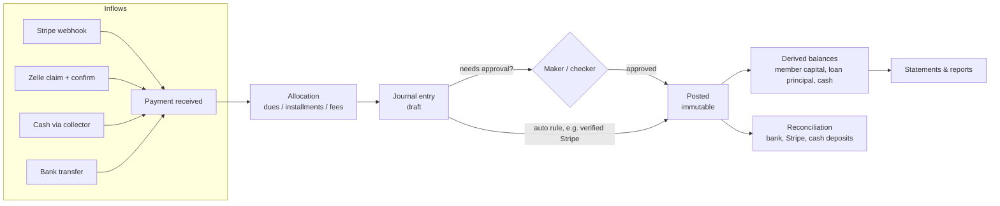
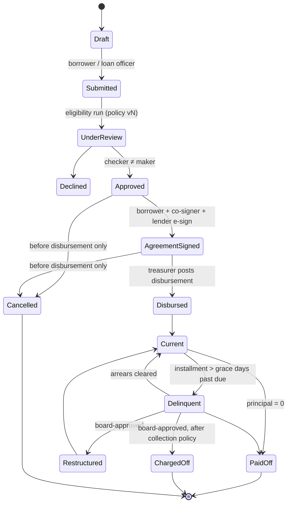

# 5–7. Contributions, Loans and the Financial Ledger

The three are one design. Contributions and loans are **domain workflows**; the ledger is the **single record of money**. A workflow never edits a balance. It proposes a journal entry, and balances are sums over posted entries.

## 1. Contribution management

### Model

| Concept | Meaning | Today |
|---|---|---|
| Contribution plan | What a member is expected to pay: amount, frequency, start date. Default $20 monthly. | Implicit ($20 hard-coded in the reminder email) |
| Dues obligation | One row per member per period (e.g. `2026-09`) with the amount due | Missing; `thisMonth` is a stored flag |
| Payment | Money received: date, amount, method, provider reference, received-by | `Contribution` conflates this with the period |
| Allocation | Links a payment to one or more obligations (supports prepayment and partial payment) | Missing |
| Receipt | Numbered, immutable, emailed or downloadable | Missing |
| Correction | A reversal of the original entry plus a new entry; never an edit | Rows are editable and deletable |

Supported flows:

- **Recurring** contributions generate an obligation each period. A scheduled job creates the next period's obligations on the 1st.
- **One-time** contributions (special assessments, voluntary extra) are an obligation of a named category, or unallocated capital if the rules allow.
- **Prepayment**: one payment, today's date, allocated across future obligations. This replaces the current future-dated rows (F-10).
- **Categories**: `dues`, `special_assessment`, `voluntary`. More only when a rule needs them.
- **Methods**: cash (collector), Zelle, bank transfer, card (Stripe), Auto-pay. Each method has a clearing account in the ledger, so money "in transit" is visible until it is reconciled.

### Cash collected by individuals

The current records show collectors (`receivedBy`) taking cash. Add:

1. The collector records the payment in the app at the time of collection. It posts to `1030 Cash — held by collectors` under that collector's sub-ledger.
2. When the collector deposits the cash, a **deposit** entry moves it to `1000 Bank`. The Treasurer approves it by matching it against the bank statement.
3. An aging report shows cash held by each collector for more than *N* days.

### Reconciliation

| Source | Match on | Frequency |
|---|---|---|
| Bank statement (CSV import) | amount + date window + reference | monthly (weekly at scale) |
| Stripe balance transactions | Stripe `payment_intent` / `balance_transaction` IDs | daily, automated |
| Zelle | bank statement lines against confirmed claims | at each confirmation, then monthly |
| Collector cash | deposit entries against bank lines | at each deposit |

Anything unmatched stays in the clearing account and appears on the reconciliation screen. Nothing is written off without an approved adjusting entry.

### Reporting

Contribution totals, collection rate by period, members in arrears with aging, and trends. All are derived from obligations, allocations and ledger lines, and are reproducible for any past date.

## 2. Loan management

### Lifecycle

Changes from today:

- **Cancellation is only possible before disbursement**, and it is a status change, not a deletion. After disbursement the only exits are payoff, restructure or charge-off, each with ledger entries (F-3).
- **Disbursement is a posting.** It is `Dr 1100 Loans receivable (member)` / `Cr 1000 Bank`. Without it, the books cannot show where the money went (F-4).
- **Delinquency is computed** by a daily job from the installment schedule and the policy's grace days. It is never set by hand (F-6, F-12).
- **Eligibility** keeps today's rules: active membership, 6 months minimum, no current loan or co-sign, 4 × contributions capped at $5,000, and a 3-month cooldown. Each approval stores the `policyVersion` used and its inputs.
- **Agreement**: keep the current e-sign flow. Add a SHA-256 hash of the rendered agreement at each signature, so the signed text is provable.
- **Co-signer**: recorded on the loan. A co-signer's liability becomes a ledger matter only if the board invokes it.

### Payment allocation order (proposed; founder decision)

1. Fees due (late fee, if enforced)
2. Oldest overdue installment principal
3. Current installment
4. Excess: the borrower chooses between prepaying future installments (default) and reducing principal while shortening the term

### Fees

| Fee | Policy today | Recorded today | Proposal |
|---|---|---|---|
| Application fee ($30 / $50 / $70) | yes | **no** | Posted at disbursement: `Dr Bank / Cr 4000 Application fee income`, or netted from the disbursement if the board prefers |
| Late fee ($5 after 15 days) | yes | **never applied** | Founder decision whether to enforce. If yes: applied by the delinquency job, waivable by a checker with a reason. **LEGAL REVIEW REQUIRED** on late-fee limits |

### D-08 — Loan engine defaults

**DECISION:** Build the loan engine as zero-interest amortisation with configurable term, frequency, grace days and fees. Model interest as a supported but disabled capability.
**WHY:** Every current agreement says "no interest". Building interest machinery the club does not use adds legal exposure (usury, disclosure) and test burden for no benefit.
**ALTERNATIVES:** Full interest engine now; keep today's single-field `monthlyDue`.
**BENEFITS:** A correct schedule for the loans that actually exist; fees become visible income.
**RISKS:** Adding interest later requires a new policy version and a legal review, which is intended.
**REVERSIBILITY:** easy
**REQUIRES LEGAL REVIEW:** yes (fees, any future interest, disclosure obligations)
**REQUIRES FOUNDER APPROVAL:** yes (late-fee enforcement, allocation order)

## 3. Loan calculation engine

A pure TypeScript module, `src/modules/lending/engine`, with no database access. It takes inputs and returns a schedule. The same inputs always produce the same output.

**Inputs:** principal (cents), term (installments), frequency (monthly), first due date, due-day rule (10th of the following month, per policy), interest rate (basis points, default 0), grace days, fee schedule, rounding rule.

**Outputs:** the installment list (number, due date, principal, interest, total), total repayable, and the policy version.

**Rounding rule:** divide in integer cents. Every installment gets the floor amount, and the **last installment absorbs the remainder**, so the schedule always sums exactly to the principal.

| Loan | Today (float) | Engine (integer cents) |
|---|---|---|
| $10,000 / 24 | 24 × $416.67 = **$10,000.08** | 23 × $416.66 + 1 × $416.82 = **$10,000.00** |
| $5,070 / 24 | 24 × $211.25 = $5,070.00 | 24 × $211.25 = $5,070.00 |
| $1,530 / 12 | 12 × $127.50 = $1,530.00 | 12 × $127.50 = $1,530.00 |

**Payment application** is a second pure function: `(schedule, payments so far, new payment, as-of date) → allocations + new state`. It never mutates stored balances. The ledger entries it proposes are the only output that persists.

**Required tests** (see [testing strategy](11-migration-roadmap-testing.md#3-testing-strategy)):

- **Rounding:** every principal from $1 to $5,000 in $1 steps × terms {6, 12, 18, 24} → the schedule sums exactly to the principal.
- **Partial payments** spanning installments; **overpayments** (prepay versus principal reduction).
- **Early payoff** on every installment boundary and mid-period.
- **Late payments** crossing the grace boundary: fee applied once, never twice.
- **Reversal** of a payment restores the exact prior state.
- **Property:** the sum of allocations equals the payment, and principal outstanding is never negative.
- **Interest path** (when enabled): a golden table computed independently.

### D-03 — Money as integer cents

**DECISION:** Store every monetary amount as integer minor units (cents) in `BigInt` columns. All arithmetic goes through one `Money` module (add, subtract, allocate-by-ratio, format). No `Float` anywhere in money paths.
**WHY:** F-2. Floating point cannot represent most cent values exactly, and errors compound across sums.
**ALTERNATIVES:** PostgreSQL `NUMERIC` via Prisma `Decimal` (also correct; heavier types in JavaScript); a decimal library over strings.
**BENEFITS:** Exact on every database; trivial to test; fast.
**RISKS:** A one-time migration of every money column. Any future multi-currency support needs a currency column (add it now, defaulting to `USD`).
**REVERSIBILITY:** moderate
**REQUIRES LEGAL REVIEW:** no
**REQUIRES FOUNDER APPROVAL:** no

## 4. Financial ledger

### D-04 — Double-entry ledger as the system of record

**DECISION:** Introduce a double-entry general ledger inside the app. Every financial event is a balanced journal entry. Member capital, loan receivables, cash and income are all derived from it.
**WHY:** F-1, F-4, F-5, F-11 and F-13. The club currently cannot produce a trial balance, a cash position or a reproducible statement for a past date.
**ALTERNATIVES:** (a) Keep the stored fields and add an audit log. This detects edits but still has no cash position and no balancing. (b) Use external accounting software (e.g. QuickBooks) as the ledger and sync to it. This splits the source of truth, member-level sub-ledgers are awkward, and it is another vendor holding member data. (c) A hosted ledger API. This is overkill at this volume and adds a data processor.
**BENEFITS:** Reproducible reports, a true cash position, auditability, and a precondition for any rewards or UMI programme being trustworthy.
**RISKS:** The biggest change in the plan. It needs a careful migration ([§23](11-migration-roadmap-testing.md#1-migration-strategy)) and an accountant's sign-off on the chart of accounts.
**REVERSIBILITY:** difficult (once live, the ledger is the books)
**REQUIRES LEGAL REVIEW:** yes (accounting classification of member capital, below)
**REQUIRES FOUNDER APPROVAL:** yes

### Chart of accounts (proposed; accountant to confirm)

| Code | Account | Type | Sub-ledger |
|---|---|---|---|
| 1000 | Bank — operating | Asset | per bank account |
| 1010 | Stripe clearing | Asset | — |
| 1020 | Zelle / bank transfer clearing | Asset | — |
| 1030 | Cash held by collectors | Asset | per collector |
| 1100 | Loans receivable — principal | Asset | per member (per loan) |
| 1110 | Fees receivable | Asset | per member |
| 1190 | Allowance for loan losses | Contra-asset | — |
| 2000 | Member capital accounts | Liability **or** Equity — *see below* | per member |
| 2100 | Unapplied member payments | Liability | per member |
| 2200 | Withdrawals payable | Liability | per member |
| 3000 | Club surplus / retained | Equity | — |
| 4000 | Loan application fee income | Income | — |
| 4010 | Late fee income | Income | — |
| 4900 | Other income (future: sponsorship, interest on deposits) | Income | — |
| 5000 | Payment processing fees | Expense | — |
| 5010 | Operating expenses (hosting, email, bank fees) | Expense | — |
| 5100 | Loan losses | Expense | — |
| 9000 | Opening balance equity (migration only; must net to zero) | Equity | — |

**Member capital classification — LEGAL / ACCOUNTING REVIEW REQUIRED.** Members can withdraw (`Partial`, `Full Exit`), which suggests contributions are refundable member balances, i.e. a liability. If they are the members' equity in the club instead, that changes the financial statements and possibly the regulatory analysis. The ledger supports either classification; the decision belongs to an accountant and counsel.

### Journal entry shape

| Field | Notes |
|---|---|
| `id`, `entryNumber` | UUID; human sequential number per year (`JE-2026-000123`) |
| `effectiveDate`, `createdAt`, `postedAt` | effective date for reporting; timestamps for audit |
| `type` | `contribution`, `loan_disbursement`, `loan_repayment`, `fee`, `withdrawal`, `deposit`, `adjustment`, `reversal`, `opening_balance`, … |
| `status` | `draft` → `pending_approval` → `posted`; or `rejected`. **Posted is final.** |
| `description`, `reference` | e.g. Stripe event ID, bank reference, receipt number |
| `sourceType`, `sourceId` | the domain record that caused it (payment, loan, withdrawal) |
| `idempotencyKey` | unique; e.g. `stripe:evt_…`, `zelle-confirm:<portalPaymentId>` |
| `reversesEntryId` | set on reversals; the original gets `reversedByEntryId` |
| `createdBy`, `approvedBy`, `approvalRequestId` | maker and checker (different users, enforced) |
| lines[] | `accountCode`, `memberId?`, `loanId?`, `debitCents`, `creditCents` (exactly one non-zero, positive) |

### Example postings

| Event | Debit | Credit |
|---|---|---|
| $20 contribution by card | 1010 Stripe clearing $20.00 | 2000 Member capital (member) $20.00 |
| Stripe fee on it | 5000 Processing fees $0.88 | 1010 Stripe clearing $0.88 |
| Stripe payout to bank | 1000 Bank | 1010 Stripe clearing |
| $20 cash to a collector | 1030 Cash — collector X | 2000 Member capital (member) |
| Collector deposits $400 | 1000 Bank $400 | 1030 Cash — collector X $400 |
| Loan disbursed $5,000 | 1100 Loans receivable (member, loan) $5,000 | 1000 Bank $5,000 |
| Application fee $70 | 1000 Bank $70 | 4000 Application fee income $70 |
| Repayment $211.25 (Zelle) | 1020 Zelle clearing → then 1000 Bank | 1100 Loans receivable (member, loan) |
| Member withdrawal $500 | 2000 Member capital (member) $500 | 1000 Bank $500 |
| Correction of a mis-keyed $20 | a **reversal** of the original entry, then a new correct entry | — |
| Opening balance (migration) | 9000 Opening balance equity | 2000 Member capital (member), per member |

*The $0.88 fee is illustrative. Actual Stripe pricing must be taken from the club's account. Whether the member or the club absorbs processing fees is a founder decision.*

### Invariants (enforced in code, verified nightly, alert on failure)

1. For every entry, sum(debits) = sum(credits) > 0.
2. Posted entries and their lines are never updated or deleted. This is enforced by database permissions or triggers, not just the application.
3. A reversal exactly mirrors its original, and an entry can be reversed at most once.
4. Trial balance: sum of all debits = sum of all credits.
5. Loan receivable per loan = disbursed − principal repaid − write-offs, never negative.
6. Every Stripe event, Zelle confirmation and bank import line maps to at most one entry (idempotency key uniqueness).
7. Maker ≠ checker on every entry that required approval.

### D-05 — Immutability and no hard deletes

**DECISION:** Posted journal entries are immutable. Corrections are reversing entries. Members, loans, payments and agreements are never hard-deleted; they are voided or closed with a reason.
**WHY:** F-3, F-12, and Master Prompt §6. Silent edits make every report unreproducible.
**ALTERNATIVES:** Allow edits and keep an audit log of prior values. This is weaker: reports for a past date silently change.
**BENEFITS:** Any past statement can be regenerated exactly; fraud and mistakes leave evidence.
**RISKS:** Mistakes need two entries to fix, and the UI must make reversal easy.
**REVERSIBILITY:** moderate
**REQUIRES LEGAL REVIEW:** no (confirm the retention period with counsel)
**REQUIRES FOUNDER APPROVAL:** yes (policy change for staff)

### D-06 — Maker / checker

**DECISION:** These actions require a second, different authorised user to approve before they take effect:

| Action | Maker | Checker | Threshold |
|---|---|---|---|
| Manual journal entry / adjustment | Finance | Treasurer | all |
| Loan approval | Loan Officer | Treasurer or Board | all |
| Loan disbursement | Treasurer | Board member | all |
| Withdrawal payout | Finance | Treasurer | all |
| Zelle claim confirmation | Finance | — (single) | ≤ $100; two above that |
| Cash deposit posting | Collector / Finance | Treasurer | all |
| Fee waiver | Loan Officer | Treasurer | all |
| Write-off / restructure | Treasurer | Board (2 members) | all |
| Verified Stripe payment | system | — | auto-posts |

**WHY:** S-2. Today one admin can record, confirm and edit any money movement.
**ALTERNATIVES:** Audit log only (detective, not preventive); thresholds only for large amounts.
**BENEFITS:** No single person can move or misstate money unnoticed.
**RISKS:** The club needs at least three active officers with distinct roles. Approvals add latency, so the approval queue must be visible on the dashboard.
**REVERSIBILITY:** easy (thresholds are configuration)
**REQUIRES LEGAL REVIEW:** no
**REQUIRES FOUNDER APPROVAL:** yes (who the officers are; thresholds)

### Periods and reporting

- Monthly period close: after reconciliation, the Treasurer closes the period. Entries dated in a closed period are rejected, and corrections go into the current period.
- Reports: trial balance, member statement, loan portfolio, aging, cash flow and income statement. Each is a query over posted lines as of a date, so every report can be regenerated for any past date.
