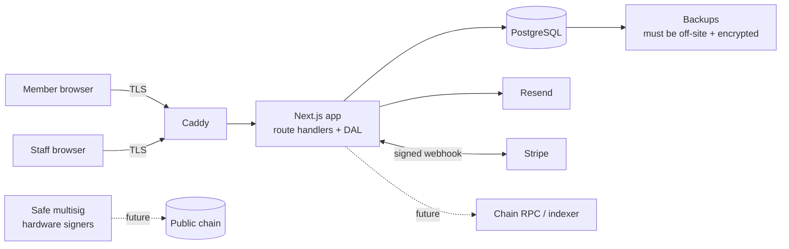

# 8–9. Security Threat Model and Privacy Architecture

## 1. Threat model

### Assets

| Asset | Why it matters |
|---|---|
| Member PII (names, contacts, beneficiaries, IDs) | Identity theft, harm to members, legal liability |
| Financial records (contributions, loans, balances) | Integrity of the club; member trust; regulatory evidence |
| Money-moving authority (bank access, Stripe, disbursement approval) | Direct theft |
| Staff accounts | They are the path to both of the above |
| Signed agreements | Enforceability of loans |
| *(future)* MCTN mint authority and treasury signer keys | Unlimited token issuance; treasury drain |

### Actors

External attacker (credential stuffing, phishing, web exploits); a malicious or careless member (another member's data, fake payment claims); a **malicious or compromised insider** (an admin, collector or treasurer — the most likely source of loss in a small club); third-party processors (Stripe, Resend, the hosting provider); *(future)* on-chain adversaries (MEV, phishing approvals, contract exploits).

### Trust boundaries

### STRIDE analysis (current controls → gaps)

| Threat | Example | Current control | Gap → mitigation |
|---|---|---|---|
| **Spoofing** | Stolen admin password | bcrypt hashes, generic login errors, per-account rate limit (in-memory) | No MFA; rate limit resets on restart → **passkeys/TOTP for all staff**; persistent rate limiting; login alerts |
| | Forged Stripe callback | Webhook signature verified | Keep; alert on signature failures |
| | Fake Zelle claim | Admin confirms against the bank | Confirmation is a single admin → maker/checker above $100 (D-06); require the bank reference |
| **Tampering** | An admin edits a balance or marks a loan paid | Allow-listed PATCH fields | Status and overdue are still editable (F-12); no ledger → immutable ledger (D-04, D-05), event-driven states |
| | An admin deletes a loan and its payments | none | F-3 → no hard deletes |
| **Repudiation** | "I never approved that disbursement" | none | **Append-only audit log** (actor, action, before/after, IP, request ID); approvals signed by the approver's session |
| **Information disclosure** | A member reads another member's loan | Server-side ownership checks on portal and agreement routes | Keep; add automated authorisation tests per route |
| | PII leaked from git or backups | Private repository | Seed PII in git (S-7); unencrypted same-host backups (S-6) → encrypt, off-site, rotate |
| | Leaked session token | HttpOnly cookie | 30-day JWT, not revocable (S-1) → database sessions, 8–12 h staff idle timeout |
| **Denial of service** | Login flooding; webhook flooding | In-memory rate limit | Persistent limits at the proxy and app; Caddy request limits |
| **Elevation of privilege** | A demoted admin keeps access | none | S-1 → authorisation reads roles from the database on every sensitive action (Next.js "Data Access Layer" pattern) |
| | Admin creates another super admin | Super-admin-only route | Require board approval for super-admin grants; alert on every grant |

### Blockchain-specific threats (for Phases 12–17; not built yet)

| Threat | Mitigation |
|---|---|
| Mint key compromise → unlimited issuance | No EOA minter. Mint only via a rewards contract with an on-chain per-period ceiling; the admin role sits in a Safe |
| Treasury drain by one signer | Safe 3-of-5, hardware wallets, spending limits, per-purpose Safes (D-14) |
| Signature replay (claims, permits) | EIP-712 domain separation with chain ID + contract address, per-claim nonces, expiries |
| Reentrancy | OpenZeppelin `ReentrancyGuard` on claim functions; checks-effects-interactions |
| Upgrade hijack | Non-upgradeable token (D-12); if any contract is upgradeable, upgrades go through a Safe plus a timelock |
| Phishing members into approvals | Embedded wallets with transaction simulation; no `approve` flows in MC's own UI |
| Contract bug | Invariant and fuzz tests, an independent audit, testnet soak, a pause switch on reward claims, not on balances |

### D-07 — RBAC with database-backed authorisation and staff MFA

**DECISION:** Replace `admin` / `super_admin` with roles and permissions stored in the database. Every sensitive route checks permissions through a single Data Access Layer that reads the session and roles from the database, not from the JWT. Require MFA (passkey or TOTP) for every staff role.
**WHY:** S-1, S-2, S-3. The Next.js 16 documentation (`node_modules/next/dist/docs/01-app/02-guides/authentication.md`) itself recommends that the proxy layer do only "optimistic" checks and that real authorisation live in a Data Access Layer close to the data.
**ALTERNATIVES:** Keep two roles and add more `isSuperAdmin` checks; move to a hosted identity provider (Auth0, Clerk).
**BENEFITS:** Instant revocation; least privilege; the prerequisite for maker/checker.
**RISKS:** One database read per protected request, which is negligible at this scale. Staff must enrol MFA.
**REVERSIBILITY:** moderate
**REQUIRES LEGAL REVIEW:** no
**REQUIRES FOUNDER APPROVAL:** yes (role assignments)

### RBAC and maker/checker

| Permission | Member | Loan Officer | Finance | Treasurer | Compliance | Auditor | Board | Admin | Super Admin |
|---|:-:|:-:|:-:|:-:|:-:|:-:|:-:|:-:|:-:|
| View own profile / statements | ✓ | | | | | | | | |
| View all members | | ✓ | ✓ | ✓ | ✓ | ✓ | ✓ | ✓ | ✓ |
| Edit member contact details | own | | ✓ | | | | | ✓ | |
| Change member status | | | | | | | approve | propose | |
| Record payment / propose entry | | | ✓ | ✓ | | | | | |
| Approve entry | | | | ✓ | | | ✓ | | |
| Create / review loan application | | ✓ | | | | | | | |
| Approve loan / disbursement | | | | ✓ | | | ✓ | | |
| Reconcile bank | | | | ✓ | | | | | |
| Close period | | | | ✓ | | | | | |
| Read audit log | | | | ✓ | ✓ | ✓ | ✓ | | ✓ |
| Manage users / roles | | | | | | | approve | ✓ | ✓ |
| *(future)* propose treasury transaction | | | | ✓ | | | | | |

No role can approve its own proposal. The Administrator manages accounts but has **no** financial rights, which separates access administration from money. Super Admin is break-glass: every use notifies the board.

### Operational security baseline (Phase 5 exit criteria)

- MFA enforced for staff; staff sessions time out after 12 hours or 30 minutes idle.
- Secrets in environment files on the server with `600` permissions, never in git. Rotate `NEXTAUTH_SECRET` and the database password from their example values.
- Nightly encrypted backups (e.g. `age`/`gpg`) to off-site object storage; weekly restore test; recovery point objective 24 h, recovery time objective 4 h to start.
- Content-Security-Policy, HSTS (Caddy), and a dependency audit in CI (`npm audit --audit-level=high`).
- Structured logging of authentication events, approvals and postings, with alerts on failed-login spikes, super-admin use, and postings above a threshold.

## 2. Privacy architecture

### Data classification

| Class | Examples | Rules |
|---|---|---|
| **Restricted** | government ID images, bank account numbers, passwords/hashes, MFA secrets, future private keys | Never in logs, emails or git. Stored encrypted (files: encrypted object storage; secrets: KMS or `age`). Access by named role only, and every access is logged |
| **Confidential** | names, contacts, beneficiaries, loan and contribution records, balances, wallet ↔ member links | Encrypted at rest (disk) and in transit; role-based access; only in member-scoped emails |
| **Internal** | aggregate stats, policy config, audit metadata | Staff-visible |
| **Public** | club name, published policies, *(future)* MCTN contract address, total supply | May be published |

### Where personal data lives today

| Location | Data | Action |
|---|---|---|
| PostgreSQL | everything | Keep; encrypted volume; least-privilege database users (app user cannot `DELETE`/`UPDATE` posted ledger rows) |
| `prisma/seed-data.json`, `historical-loans.json` in git | 211 real members, loans | Move real data to an encrypted import file outside git; dev and CI use a synthetic fixture. Consider history rewriting only if the repository is ever shared (founder decision) |
| Backups | full database | Encrypt; off-site; retention policy |
| Resend (email) | names, member IDs, amounts in reminder emails | Processor; keep emails minimal; a data-processing agreement |
| Stripe | payment metadata (`portalPaymentId` only by design) | Keep metadata non-identifying |
| Application logs | IPs, user IDs | No PII in log messages; 30-day retention |

### Principles applied

1. **Minimisation.** Collect only what a workflow needs. For example, do not collect government ID until verification is actually required (UMI or rewards anti-fraud).
2. **Purpose limitation.** Loan data is for lending decisions only. It is never fed into rewards or UMI scoring without an explicit policy.
3. **Member access.** Members can view and export their own data and statements, and request corrections, which go through the correction workflow, never silent edits.
4. **Retention.** Financial records: at least 7 years after the relationship ends (counsel to confirm). Identity documents: deleted after verification plus the legal minimum. Logs: 30–90 days.

### On-chain privacy rule (§31)

Nothing identifying or financial goes on a public chain: no names, contacts, balances, loan data, contribution history or IDs, and **no hash of any of these**. Hashes of low-entropy data such as names or member numbers can be brute-forced.

**The wallet ↔ member link is itself Confidential.** If MC publishes "wallet 0xabc belongs to a member," every past and future transaction of that wallet is de-anonymised. Therefore:

- Wallet links are stored off-chain only.
- Reward settlement uses per-member wallets that the member controls, never a public registry mapping members to addresses.
- Any on-chain membership proof, if one is ever justified, uses an attestation that reveals only "is a current member", issued to an address the member chooses, and revocable.
