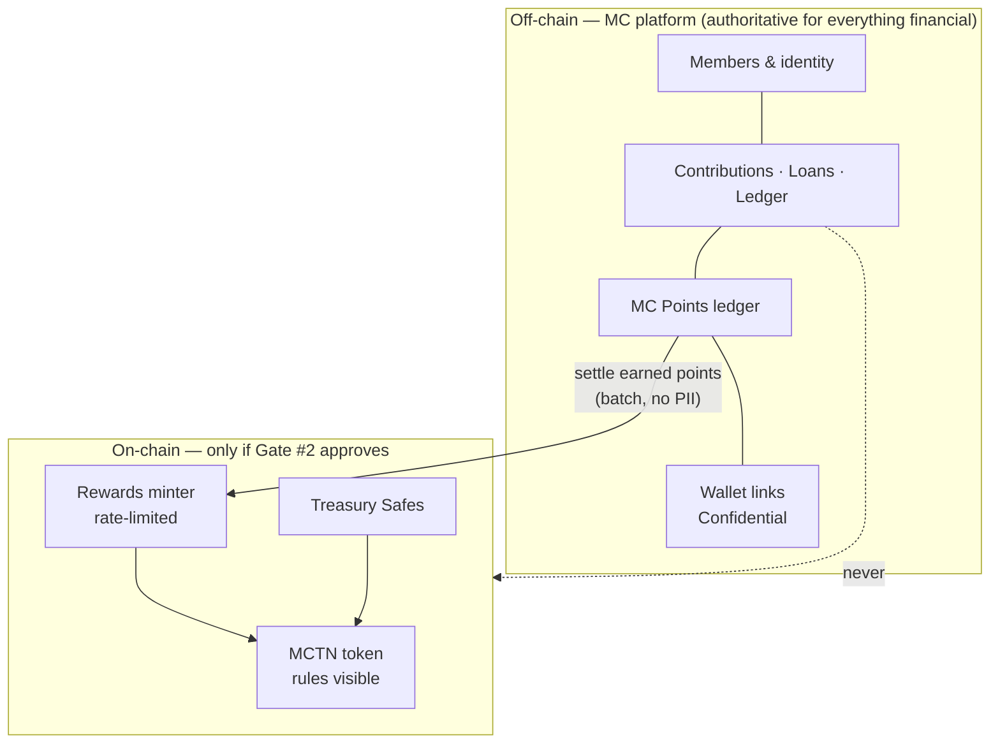
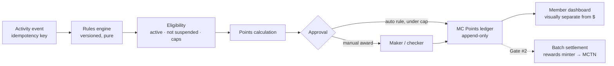

# 10–14. Web3 Boundary, MCTN, Chain Selection, Tokenomics and Rewards

> **Nothing in this document authorises building or deploying a token.** It is research for Founder Decision Gate #1. Contract work waits for Gate #2 and the legal scoping review (D-16).

## 1. Web2 / Web3 boundary

Every candidate item was tested against §3: *what problem does putting this on-chain solve?*

| Data / function | Where | On-chain would solve… | Verdict |
|---|---|---|---|
| Member PII, profiles, documents | Off-chain | nothing; public and permanent is the opposite of what PII needs | **Off-chain, permanently** |
| Contributions, dues, receipts | Off-chain | nothing that the ledger does not, and it would publish members' finances | **Off-chain** |
| Loans, applications, schedules, agreements | Off-chain | nothing; loans need privacy, correction and legal enforceability | **Off-chain** |
| Fiat ledger, bank, reconciliation, compliance records | Off-chain | nothing | **Off-chain** |
| Wallet ↔ member link | Off-chain | — (publishing it de-anonymises members) | **Off-chain** |
| MC Points (rewards) balances | Off-chain first | portability and member-verifiable balances, but only once members want to hold them outside MC | **Off-chain now; on-chain settlement optional later** |
| MCTN balances and transfers, *if* issued | On-chain | a public, tamper-evident balance record not dependent on MC's database | On-chain (by definition) |
| MCTN supply, mint limits, vesting | On-chain | members can verify that issuance rules cannot be quietly changed | **On-chain**; this is the strongest real benefit |
| MCTN treasury movements | On-chain (Safe) | members can see that token reserves did not move without multi-party approval | **On-chain** |
| Membership proof | — | nothing identified today | **Not built** |
| Governance voting | — | only if members are ever given binding votes on token rules | **Deferred** |
| UMI distribution | — | nothing until UMI is funded and legal | **Not built** |

### D-09 — PII and fiat financial records stay off-chain, permanently

**DECISION:** No member PII, no fiat financial record, no hash of either, and no public wallet ↔ member mapping is ever written to a public chain.
**WHY:** §19 and §31. Once on a public chain, data cannot be deleted or corrected. See the [privacy rule](05-security-and-privacy.md#on-chain-privacy-rule).
**ALTERNATIVES:** Hashed or encrypted records on-chain "for transparency". Rejected: low-entropy hashes are reversible; encrypted data is permanently exposed to future key compromise.
**BENEFITS:** Removes the largest irreversible risk in the programme.
**RISKS:** None material. Transparency goals are met by publishing aggregate, audited reports instead.
**REVERSIBILITY:** difficult. A violation cannot be undone, which is why this is fixed up front.
**REQUIRES LEGAL REVIEW:** no
**REQUIRES FOUNDER APPROVAL:** yes

## 2. MCTN feasibility

### What each proposed use actually needs

| Proposed use (§10) | Needs a blockchain? | Cheaper equivalent | Risk added by going on-chain |
|---|---|---|---|
| Member rewards / loyalty | No | Off-chain points ledger | Custody, tax reporting, securities if transferable |
| Membership benefits, discounts | No | Points or member status | — |
| Educational incentives | No | Points | Sybil farming if points become sellable |
| Community participation | No | Points | same |
| Events | No | Points or tickets | — |
| Recognition programmes | No | Badges in the app | — |
| Marketplace payments | Only if external merchants accept it | Points redeemable in-app; USD via Stripe | Money-transmission and stored-value rules |
| Governance | Only if votes must be binding and verifiable outside MC | Recorded board/member votes | Securities indicators; plutocracy if token-weighted |

**Finding:** every near-term utility works as an off-chain points programme. A token earns its keep only when members want to **hold, verify or use their rewards outside the MC app**. That has not been demonstrated yet. On-chain also brings real costs: wallets, gas, key management, audits, tax reporting, and the regulatory questions in the [compliance matrix](09-compliance-matrix.md).

### D-10 — Start with MC Points (off-chain), designed to settle on-chain later

**DECISION:** Launch rewards as **MC Points**: a non-transferable, non-redeemable-for-cash, off-chain ledger inside the platform. Design the points ledger so earned points can later be settled 1:1 into MCTN if Gate #2 approves a token.
**WHY:** It delivers all the member-facing value in §10 with no custody, gas, audit or securities exposure. It also produces real usage data (how many points are earned, what members do with them) to size MCTN properly (D-13).
**ALTERNATIVES:** Deploy MCTN directly on an L2 as a non-transferable token; do nothing.
**BENEFITS:** Fast and reversible; no irreversible contract deployment before the legal review.
**RISKS:** Members may perceive points as "not real crypto". The mitigation is to message it as MC Points from the start and make any later MCTN settlement an upgrade, not a promise.
**REVERSIBILITY:** easy
**REQUIRES LEGAL REVIEW:** yes (tax treatment of rewards; consumer-protection wording)
**REQUIRES FOUNDER APPROVAL:** yes

### Name clearance (§11) — not performed in this pass

Planned for Phase 6. It produces a conflict matrix across CoinMarketCap, CoinGecko, block explorers on each shortlisted chain, DEX and CEX listings, ENS and Web3 domains, ICANN domains, GitHub, social handles, and USPTO records. It will separate **ticker availability**, **brand availability**, **domain availability** and **trademark / legal clearance**. Internet research can establish the first three at a point in time. Only counsel can give the fourth.

## 3. Blockchain comparison

Qualitative comparison as of this writing. Fees, rollup maturity and ecosystem status change; re-verify every row at decision time (e.g. rollup "stage" on L2BEAT, fee dashboards, and wallet-provider chain support).

| Criterion | Ethereum L1 | Base | Arbitrum One | OP Mainnet | Polygon PoS | Solana |
|---|---|---|---|---|---|---|
| Security model | Highest; the base layer | Optimistic rollup on Ethereum (OP Stack) | Optimistic rollup on Ethereum | Optimistic rollup on Ethereum (OP Stack) | Own validator set (sidechain); does not inherit Ethereum security the way rollups do | Own validator set (L1) |
| Fees for small reward transfers | High; unsuitable for frequent small transfers | Very low | Very low | Very low | Very low | Very low |
| Operator dependency | None | Sequencer run by one company (Coinbase) | Sequencer run by Offchain Labs; DAO governance | Optimism Foundation / Collective | Polygon Labs + validators | Validator network; past outages |
| Wallet & onboarding ecosystem | Broadest | Strong consumer focus (smart wallets, passkeys) | Broad | Broad | Broad | Strong, different stack (Phantom etc.) |
| Account abstraction / smart wallets | ERC-4337, EIP-7702 | ERC-4337; check 7702 support | ERC-4337; check 7702 | ERC-4337; check 7702 | ERC-4337 | Native programmable accounts; different model |
| Token standard / tooling | ERC-20 + OpenZeppelin + Foundry | same (EVM) | same (EVM) | same (EVM) | same (EVM) | SPL / Token-2022 (has a native *non-transferable* extension); Rust / Anchor |
| Multisig | Safe | Safe | Safe | Safe | Safe | Squads |
| Portability to another chain | — | High (any EVM chain) | High | High | High | Low (different VM) |
| Operational complexity for a small team | High (fees) | Low | Low | Low | Low | Medium (new language and tooling) |
| Long-term ecosystem risk | Lowest | Tied to one sponsor's strategy | Moderate | Moderate | Moderate; architecture in transition | Moderate; different trade-offs |

### D-11 — Preliminary shortlist, not a selection

**DECISION:** If MCTN is approved, shortlist **EVM rollups: Base, Arbitrum One and OP Mainnet**. Choose among them after a testnet prototype, using the wallet provider chosen in §6 and the then-current rollup maturity. Exclude Ethereum L1 (fees for small, frequent rewards) and Polygon PoS (weaker security inheritance). Keep Solana as the alternative if a native non-transferable token becomes decisive, accepting the cost of a second tech stack.
**WHY:** Low fees suit small rewards. Rollups inherit Ethereum security, and the EVM gives the OpenZeppelin, Foundry and Safe toolchain. Contracts stay portable between EVM chains.
**ALTERNATIVES:** Solana; Ethereum L1; an app-specific chain (far too much operational burden).
**BENEFITS:** Lowest operational risk for a small team; no lock-in within the EVM family.
**RISKS:** All three rely on a centralised sequencer today, which is acceptable for a rewards token (liveness risk, not custody risk).
**REVERSIBILITY:** moderate (after deployment, moving chains means a token migration)
**REQUIRES LEGAL REVIEW:** no
**REQUIRES FOUNDER APPROVAL:** yes

### Token standard (§13)

If an EVM chain is chosen: OpenZeppelin Contracts ERC-20, with only the features that have a documented need.

| Feature | Include? | Reason |
|---|---|---|
| `ERC20` | yes | base |
| Transfer restriction (override `_update` to allow only mint and burn) | **yes, if non-transferable** (recommended at launch) | Keeps MCTN a reward, not a tradable asset, until secondary trading is deliberately decided |
| `ERC20Burnable` | yes | Spending points or MCTN on benefits burns them (the utility sink) |
| `ERC20Capped` | only for Model B | Model C enforces its ceiling in the minter instead |
| `ERC20Permit` | no | No approvals are needed for a non-transferable token |
| `ERC20Votes` | no | No governance is planned; adding votes early signals an investment-like instrument |
| `ERC20Pausable` | no on the token | Pause the **minter and claims**, not members' balances |
| Access control | `AccessManager` / `AccessControl`; admin = Treasury Safe behind a timelock | No EOA holds any role; role changes are public and delayed |
| Upgradeability | **no** | Immutable rules are the point; changes happen by migrating to a new token |

### D-12 — Minimal, non-upgradeable token; minting only through a rate-limited minter

**DECISION:** If deployed, `MCTNToken` is a non-upgradeable OpenZeppelin ERC-20 whose only minter is `MCTNRewardsMinter`. The minter enforces a hard per-period issuance ceiling on-chain and is administered by the Treasury Safe.
**WHY:** It limits the damage from any single key compromise. On-chain issuance rules are the main transparency benefit of a token.
**ALTERNATIVES:** Upgradeable proxy (flexible, but any key holder can change the rules); multiple minters; transferable from day one.
**BENEFITS:** Small audit surface; rules members can verify.
**RISKS:** Bugs cannot be patched in place. The mitigation is a small contract, an independent audit, testnet soak, and the ability to pause the minter.
**REVERSIBILITY:** difficult
**REQUIRES LEGAL REVIEW:** yes
**REQUIRES FOUNDER APPROVAL:** yes

## 4. Preliminary tokenomics

Three models, generated by [`scripts/models/tokenomics.mjs`](../../scripts/models/tokenomics.mjs). All numbers are illustrative. The reward rate (1,200 per active member per year) is a unit of account chosen for comparability; the absolute size means nothing until a point is tied to a real benefit. What matters is the **shape**: who holds the circulating supply, and how supply grows.

Assumptions: 114 active members today; reward rate 1,200 MCTN per active member per year;
adoption reaches 200 (conservative), 1,000 (base), 10,000 (aggressive) active members by year 10 at a constant growth rate.
Initial circulating supply is 0 in every model: nothing is released until a member earns it or a vesting schedule unlocks it.

#### Model A — Fixed supply, pre-minted at genesis

| Allocation | % | MCTN | Release |
|---|---:|---:|---|
| Member rewards | 35.0% | 35,000,000 | Released only as members earn rewards |
| Community programs | 10.0% | 10,000,000 | Assumed 1,000,000/yr program spend |
| Treasury | 20.0% | 20,000,000 | Multisig; assumed 2%/yr (400,000) spent |
| Ecosystem development | 10.0% | 10,000,000 | 60-month linear release |
| Team / founders | 10.0% | 10,000,000 | 12-month cliff, then 36-month linear |
| Liquidity | 0.0% | 0 | None until secondary trading is decided |
| Reserve | 15.0% | 15,000,000 | Locked; not modelled as circulating |
| **Total** | 100% | 100,000,000 | |

| Adoption | Supply Y5 | Circulating Y5 | Member-earned share Y5 | Supply Y10 | Circulating Y10 | Member-earned share Y10 | Note |
|---|---:|---:|---:|---:|---:|---:|---|
| conservative | 100,000,000 | 27,789,600 | 2.8% | 100,000,000 | 35,836,000 | 5.1% | 33,164,000 rewards left |
| base | 100,000,000 | 28,240,800 | 4.4% | 100,000,000 | 38,914,000 | 12.6% | 30,086,000 rewards left |
| aggressive | 100,000,000 | 29,600,400 | 8.8% | 100,000,000 | 60,955,600 | 44.2% | 8,044,400 rewards left |

#### Model B — Capped supply, minted on demand

| Allocation | % | MCTN | Release |
|---|---:|---:|---|
| Member rewards | 60.0% | 60,000,000 | Minted only when earned; on-chain ceiling 5,000,000/yr |
| Community programs | 10.0% | 10,000,000 | Minted as spent; assumed 500,000/yr |
| Treasury | 15.0% | 15,000,000 | Genesis mint to multisig; assumed 2%/yr (300,000) spent |
| Ecosystem development | 5.0% | 5,000,000 | Genesis mint; 60-month linear release |
| Team / founders | 5.0% | 5,000,000 | Genesis mint; 12-month cliff, then 36-month linear |
| Liquidity | 0.0% | 0 | None until secondary trading is decided |
| Reserve | 5.0% | 5,000,000 | Genesis mint; locked |
| **Total** | 100% | 100,000,000 (cap) | |

| Adoption | Supply Y5 | Circulating Y5 | Member-earned share Y5 | Supply Y10 | Circulating Y10 | Member-earned share Y10 | Note |
|---|---:|---:|---:|---:|---:|---:|---|
| conservative | 33,289,600 | 14,789,600 | 5.3% | 36,836,000 | 19,836,000 | 9.3% | Y10 reward paid 1,200/member (target 1,200) |
| base | 33,740,800 | 15,240,800 | 8.1% | 39,914,000 | 22,914,000 | 21.4% | Y10 reward paid 1,200/member (target 1,200) |
| aggressive | 35,100,400 | 16,600,400 | 15.7% | 55,832,400 | 38,832,400 | 53.6% | Y10 reward paid 610/member (target 1,200) |

#### Model C — Controlled emissions, no fixed cap (hard annual ceiling)

| Allocation | % | MCTN | Release |
|---|---:|---:|---|
| Member rewards | — | per emissions | Emitted per active member; hard ceiling 10,000,000/yr |
| Community programs | — | per emissions | Funded from treasury, not a separate allocation |
| Treasury | — | 5,000,000 | Genesis mint to multisig; assumed 2%/yr (100,000) spent |
| Ecosystem development | — | 2,000,000 | Genesis mint; 36-month linear release |
| Team / founders | — | 0 | Team compensated in fiat (founder decision) |
| Liquidity | — | 0 | None until secondary trading is decided |
| Reserve | — | 0 | Emission ceiling replaces a reserve |
| **Total** | — | no cap | |

| Adoption | Supply Y5 | Circulating Y5 | Member-earned share Y5 | Supply Y10 | Circulating Y10 | Member-earned share Y10 | Note |
|---|---:|---:|---:|---:|---:|---:|---|
| conservative | 7,631,680 | 3,131,680 | 20.2% | 8,468,800 | 4,468,800 | 32.9% | Y1 emission 140,400; Y10 emission 234,000 |
| base | 7,992,640 | 3,492,640 | 28.4% | 10,931,200 | 6,931,200 | 56.7% | Y1 emission 153,600; Y10 emission 1,082,400 |
| aggressive | 9,080,320 | 4,580,320 | 45.4% | 28,564,480 | 24,564,480 | 87.8% | Y1 emission 175,200; Y10 emission 9,835,200 |

### What the models show

1. **A 100,000,000 fixed supply is oversized for this club.** Under conservative growth, Model A's 35M reward pool still has 33M left after ten years. The size would have been picked for optics, not need.
2. **Pre-allocations dominate early circulation.** In Model A at year 5, members have earned **2.8–8.8%** of circulating tokens; team, ecosystem, community and treasury releases make up the rest. A member-first token that is mostly held by insiders is the wrong shape. It is also the pattern regulators and members read as a promoter-benefit scheme.
3. **Model B** stops over-issuance (supply grows only as it is earned) but keeps the same early insider weighting. Its on-chain ceiling rations rewards under aggressive growth: 610 paid versus 1,200 intended per member in year 10.
4. **Model C** ties supply to actual participation. There is no team pre-allocation, and members hold **20–45%** of circulation at year 5 and **33–88%** by year 10. The remainder is small ecosystem and treasury releases. The annual ceiling caps issuance at any growth rate.

### D-13 — Size supply from the reward policy; prefer Model C

**DECISION:** Reject a large fixed pre-mint (Model A). Prefer **Model C** (emissions per active member, hard annual ceiling, small treasury, no team pre-allocation). Model B with a much smaller cap is the fallback. Final parameters come from MC Points usage data gathered under D-10.
**WHY:** Members, not insiders, should hold most of what circulates, and supply should track real participation, not a round number.
**ALTERNATIVES:** Model A; Model B with a 100M cap.
**BENEFITS:** Fairness; no artificial-scarcity story; lower securities risk profile (no large insider allocation awaiting a market).
**RISKS:** No fixed cap means members must trust the on-chain ceiling. The mitigation is that the ceiling is immutable in the minter.
**REVERSIBILITY:** difficult (after deployment)
**REQUIRES LEGAL REVIEW:** yes
**REQUIRES FOUNDER APPROVAL:** yes

### Vesting alternatives (§17), for any allocation that exists

| Option | Cliff / vesting | Fit |
|---|---|---|
| 1 | 12-month cliff, then 36 months linear (48 months total) | Industry default. Used for the team in Models A and B |
| 2 | 6-month cliff, 24 months linear | Faster; weaker long-term alignment |
| 3 | Milestone-based (release on member-count or audit milestones) | Aligns with delivery; harder to verify objectively |
| 4 | **No team token allocation; team paid in fiat** | **Recommended (Model C).** Removes the main conflict of interest |
| 5 | Team earns MC Points under the same rules as members | Consistent with a member-first design |

Any vesting uses OpenZeppelin `VestingWallet` (audited, no custom code), with the beneficiary's own address, never an MC-held key.

## 5. Rewards architecture

### Earning (proposal; founder decision)

| Source | Example | Note |
|---|---|---|
| Membership milestones | 1, 3, 5, 10 years of membership | Tenure, not money |
| Education | complete a financial-literacy module | Rate-limited per module |
| Events and volunteering | attend a meeting, help at an event | Recorded by an officer; maker/checker |
| Eligible referrals | the referred person becomes Active and stays 6 months | Paid only after the holding period (anti-farming) |
| Contribution consistency | *e.g.* 12 consecutive months paid | **Founder + legal decision.** Any link to contributions must not be proportional to the amount paid (§9, §22) |

**Not proposed:** points proportional to contribution size, loan size or balance. That turns rewards into a return on money paid in (§9, securities risk).

### Anti-abuse controls

- Unique constraint on `(ruleId, memberId, activityRef)`: the same activity can never pay twice (replay).
- Per-member and per-period caps in each rule; a global per-period budget.
- Manual awards need a checker, and officers cannot award themselves.
- Referral rewards need the referee's identity verified and a holding period.
- Nightly anomaly report: members above the 99th percentile, bursts, awards by the same officer.
- Rule changes are versioned. Past awards keep the rule version that produced them.

### Points ledger

Double-entry within points units: `Rewards budget (period)` → `Member points (member)`. Spending a benefit posts `Member points` → `Points redeemed` (the burn equivalent). The points ledger is **never** joined to the fiat ledger. Points never convert to cash (D-10).

## 6. Wallet architecture (MC Wallet, §18) — needed only after Gate #2

| Option | Member experience | Custody / regulatory | Verdict |
|---|---|---|---|
| No wallet (MC Points only) | none needed | none | **Phase 1** |
| Embedded non-custodial smart wallet (email, Google, Apple or passkey sign-in; keys held by the member's device or provider MPC) | easy; no seed phrase | Member holds the keys, so MC is not a custodian (counsel to confirm with the chosen provider's model) | **Phase 2 default** |
| External wallet connect (MetaMask, Rabby, hardware) | for crypto-native members | member custody | **Phase 2 option** |
| Custodial wallet (MC holds keys) | simplest | MC becomes a custodian: licensing, key risk, insurance | **Not recommended** |

Requirements for Phase 2: gas sponsored by a paymaster (budgeted in USD, funded from operating expenses); recovery by passkey plus provider recovery, never by MC admins; the member can export to a self-custodied wallet; transaction simulation before signing. Provider evaluation (security audits, pricing, chain support, exit path) happens at Phase 9. No provider is endorsed here.

## 7. Smart-contract inventory (§33) — which contracts the recommended path actually needs

| Contract | Needed? | Why on-chain? | Controls | Admin | Can mint? | Moves funds? | Pausable? | Upgradeable? | If admin keys are compromised | If it fails |
|---|---|---|---|---|---|---|---|---|---|---|
| `MCTNToken` | only after Gate #2 | verifiable balances and supply | MCTN balances | Treasury Safe through a **timelock** (e.g. 7 days); its only power is to change which contract holds the minter role | only via the minter | no | no | no | the attacker needs 3 of 5 Safe keys **and** must wait out the timelock, while the pending change is public and the honest signers can cancel it | migrate to a new token from a snapshot |
| `MCTNRewardsMinter` | only after Gate #2 | issuance limits members can verify | mint rights up to the ceiling | Treasury Safe (3-of-5) | yes, ≤ ceiling per period | no | yes (minting only) | no | the attacker can mint at most the remaining period ceiling; Safe pauses and rotates | pause; deploy a new minter; assign it through the timelocked token admin |
| Treasury | use **Safe**, not custom code | multi-party control of any token reserve | treasury MCTN | 5 signers | no | yes, with 3 of 5 | n/a | Safe modules only | needs 3 keys; signer rotation procedure in [treasury](08-treasury.md) | Safe is battle-tested; the risk is signer operations |
| `MCTNVesting` | **no** under Model C | — | — | — | — | — | — | — | — | use OpenZeppelin `VestingWallet` if any vesting is ever approved |
| `MCMembership` | **no** | nothing identified; privacy risk | — | — | — | — | — | — | — | — |
| `UMIDistributor` | **no** | UMI is not approved or funded | — | — | — | — | — | — | — | — |
